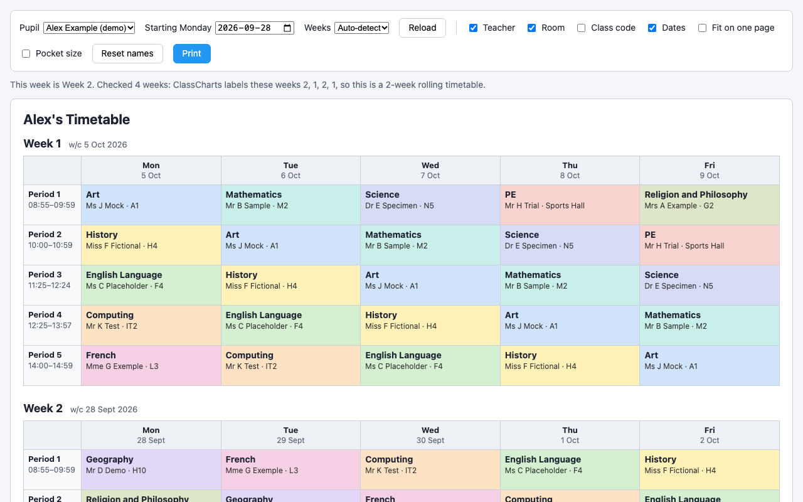
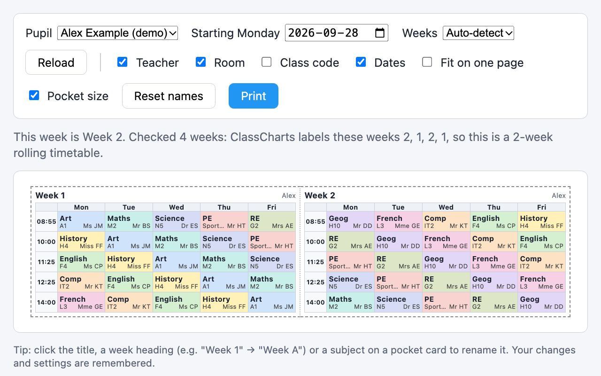
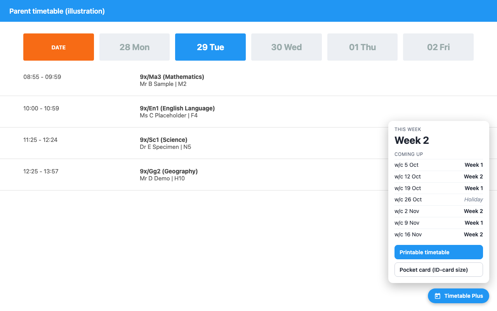
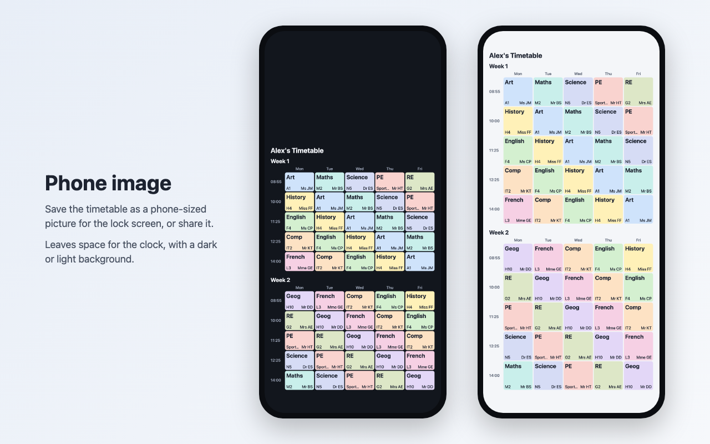
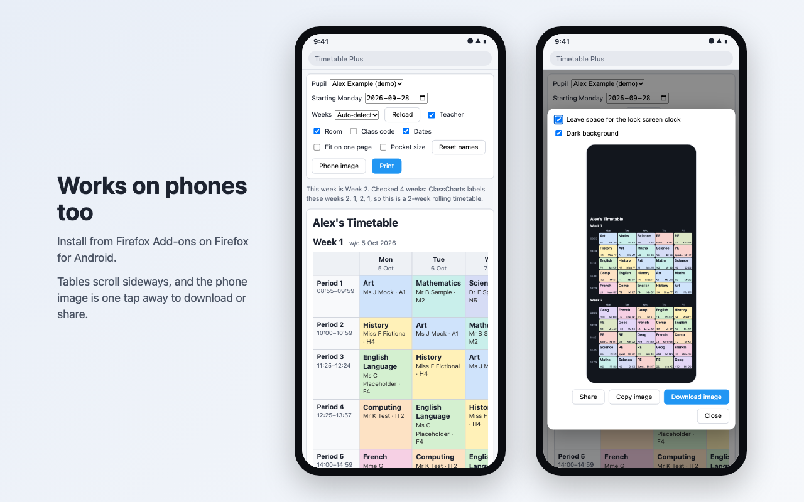

# Timetable Plus for ClassCharts

A browser extension for Chrome and Firefox that makes the ClassCharts parent timetable easier to use.
ClassCharts shows one day at a time. Timetable Plus shows the whole rota at once.

Screenshots use made-up sample data.

## Features

- Printable timetable: the whole rota on one page, colour-coded by subject, with teachers and rooms.
- Works out whether the timetable repeats every week or every two weeks.
- Pocket card: an ID-card-sized version (85.6 x 54 mm) that fits a lanyard holder.
- Phone image: a phone-sized picture of the timetable to share or use as a lock screen.
- Shows which rota week it is, plus the coming weeks with holidays marked.
- Rename the title, week headings or subjects. Your settings are remembered.

## Install

**Firefox:** install from [Firefox Add-ons](https://addons.mozilla.org/en-GB/firefox/addon/timetable-plus-for-classcharts/).

**Chrome:** coming soon to the Chrome Web Store.

### Running from source

**Chrome:** go to `chrome://extensions`, turn on Developer mode, click Load unpacked and choose the `extension` folder.

**Firefox:** go to `about:debugging#/runtime/this-firefox`, click Load Temporary Add-on and choose `extension/manifest.json`. This lasts until Firefox restarts.

## Use

1. Log in at https://www.classcharts.com/mobile/parent and open the timetable.
2. Click the blue **Timetable Plus** button in the bottom-right corner.
3. Choose **Printable timetable** or **Pocket card**, then **Print**.
4. For a phone-sized picture, click **Phone image**. Then **Copy image** to paste it into a message, **Download image** to save it, or **Share** on a phone.

Print at 100% (Actual size) so the pocket card comes out the right size. Cut along the dashed line and fold in the middle.

If it says your session has expired, reload the ClassCharts page and click **Reload**.

To preview the layout with sample data, download this repo and drag the file `extension/timetable.html` into a browser window.

## Privacy

The extension only talks to classcharts.com, using the login you already have open. Nothing is sent anywhere else. See [PRIVACY.md](PRIVACY.md).

## Building for the stores

Run `store/build.sh` to create the Chrome and Firefox zips in `dist/`. Store listing text is in `store/LISTING.md`.

This is an independent project and is not affiliated with ClassCharts or Tes.

## License

MIT. See [LICENSE](LICENSE).
